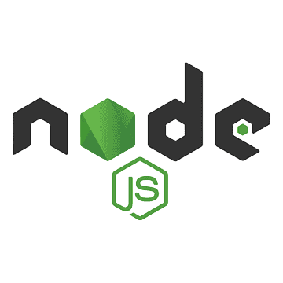

<h1 align="center">Hi World 👋, I'm Cristian</h1>
<h3 align="center">Full Stack Web Developer ❤️ from Argentina to 🌎</h3>
  
<h3>⭐ Languages and Tools:</h3>

    
    
    
    
    
    
    
    
    
    
    
    
    
    

  
<h3 align="left">📌 My proyects:</h3>

<h2 align="left">Rocket</h2>
Design and develop an App for job offers aimed at technology developers that allows them to apply to leading technology companies in the market. Managed with 7 other developers using SCRUM methodology.
  &nbsp;
  
  &nbsp;
  &nbsp;
  &nbsp;
  &nbsp;
  &nbsp;
  &nbsp;
  &nbsp;
  &nbsp;

Take a look: https://proyecto-final-nu.vercel.app/
&nbsp;

  
  
  
<h3> Contact Me!</h3>

    <a target="_blank" href='https://www.linkedin.com/in/cristian-villalba-csv/'>LinkedIn</a>  
    <a target="_blank">csv71@yahoo.com</a>  

